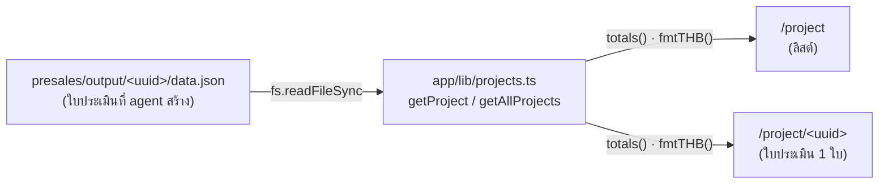

<div align="center">

# 📋 Presales Quotation

**เว็บแสดงผลใบประเมินราคาโปรเจกต์ (Presales Cost Estimation Viewer)**

แอปอ่านใบประเมินที่ "เคาะดีญะฮ์" (Presales / Solution Architect agent) สร้างไว้
แล้ว render เป็นหน้าใบเสนอราคาสวย ๆ ที่ตรวจย้อนกลับได้ทุกตัวเลข — _ราคาผูกกับ man-day, man-day ผูกกับ module, module ผูกกับ requirement_

<br/>

[](https://nextjs.org)
[](https://react.dev)
[](https://www.typescriptlang.org)
[](https://tailwindcss.com)
[](#-license)

</div>

---

## ✨ Features

- 🗂️ **ลิสต์ทุกโปรเจกต์อัตโนมัติ** — อ่านทุกใบประเมินจากโฟลเดอร์ data แล้วเรียงตามวันที่ (ใหม่สุดอยู่บน)
- 📄 **หน้าใบประเมินรายโปรเจกต์** — overview, scope, modules, man-day, ราคาช่วง (low–high), สมมติฐาน, ความเสี่ยง
- 🧮 **คำนวณสด ตรวจย้อนได้** — รวม man-day → คูณเรต → บวก contingency ผ่าน helper เดียวกัน ตัวเลขทุกบรรทัดมีที่มา
- 🔌 **Zero-config per project** — เพิ่มโปรเจกต์ใหม่แค่วางไฟล์ `data.json` ไม่ต้องแตะโค้ดเลย
- 🎨 **โทนกลาง อ่านสบาย** — UI ด้วย Tailwind v4, รองรับภาษาไทยเต็มรูปแบบ, จัดรูปแบบเงินบาท (`th-TH`)

---

## 🏗️ How It Works

แอปนี้เป็นแค่ **ตัว render** — _data_ อยู่คนละ tree (ในเวิร์กสเปซ `presales/`) แยกขาดจากตัวแอป
ทำให้ commit ราคา/ใบเสนอแยกจาก codebase ได้ และเปลี่ยน UI ได้โดยไม่แตะข้อมูล



ตำแหน่งไฟล์ data หาเจอด้วย `OUTPUT_ROOT` ใน [`app/lib/projects.ts`](app/lib/projects.ts):

```ts
const OUTPUT_ROOT =
  process.env.PRESALES_OUTPUT ??                                  // 1) override ด้วย env (absolute path)
  path.resolve(process.cwd(), "..", "..", "ai-agents", "presales", "output"); // 2) default: relative กลับไปที่ presales/output
```

> โฟลเดอร์ที่ชื่อตรงกับ pattern ของ UUID (v7) เท่านั้นที่ถูกอ่าน — โฟลเดอร์อื่นถูกข้าม

---

## 📁 Project Structure

```
presales-quotation/
├── app/
│   ├── layout.tsx              # root layout + metadata
│   ├── page.tsx                # landing page
│   ├── globals.css             # Tailwind v4 + theme
│   ├── lib/
│   │   └── projects.ts         # 💡 หัวใจ: types + อ่าน data.json + helper คำนวณ
│   └── project/
│       ├── page.tsx            # /project        → ลิสต์ทุกโปรเจกต์
│       └── [id]/page.tsx       # /project/<uuid> → ใบประเมิน 1 โปรเจกต์
├── next.config.ts
├── tsconfig.json               # path alias "@/*"
└── package.json
```

> 📌 **ข้อมูล (`data.json` / `output.html`) ไม่ได้อยู่ใน repo นี้** — อยู่ที่ `ai-agents/presales/output/<uuid>/`

---

## 🚀 Getting Started

**Prerequisites:** Node.js 20+ และโฟลเดอร์ `ai-agents/presales/output/` ที่มีใบประเมินอย่างน้อย 1 ใบ

```bash
# ติดตั้ง dependencies
npm install

# โหมดพัฒนา (hot reload)
npm run dev          # → http://localhost:3000/project

# โหมด production
npm run build        # ต้องผ่านก่อนเสมอ
npm run start
```

เปิด **[http://localhost:3000/project](http://localhost:3000/project)** เพื่อดูรายการใบประเมินทั้งหมด

---

## 🛣️ Routes

| Route | คำอธิบาย | Rendering |
|---|---|---|
| `/` | หน้าแรก | Static |
| `/project` | ลิสต์ใบประเมินทุกโปรเจกต์ | Dynamic (อ่านไฟล์ทุก request) |
| `/project/[id]` | ใบประเมิน 1 โปรเจกต์ จาก UUID | Dynamic |

> หน้าที่อ่านไฟล์ใช้ `export const dynamic = "force-dynamic"` เพื่อให้เพิ่ม/แก้ `data.json` แล้วเห็นผลทันทีโดยไม่ต้อง rebuild

---

## 🧩 Data Model

ทุกโปรเจกต์คือไฟล์ `data.json` หนึ่งไฟล์ ตาม type `Project` ใน [`app/lib/projects.ts`](app/lib/projects.ts) — ฟิลด์หลัก:

| ฟิลด์ | ความหมาย |
|---|---|
| `projectName`, `client`, `date` | ข้อมูลหัวเอกสาร |
| `summary` | สรุป man-day / ราคา ช่วง low–high |
| `scope.in` / `scope.out` | ขอบเขต in / out (กันงานบานปลาย) |
| `modules[]` | ฟีเจอร์แตกเป็น module + `mdLow`/`mdHigh` (ฐานของราคา) |
| `support[]` | งานเสริม (PM, QA, deploy ฯลฯ) |
| `rates[]` | เรต man-day หลายระดับ (Junior → Expert) |
| `contingencyPct` | % buffer ความเสี่ยง |
| `assumptions`, `risks`, `openQuestions`, `outOfPrice` | สมมติฐาน / ความเสี่ยง / คำถามค้าง / สิ่งที่ไม่รวมในราคา |

**Helper คำนวณ** (ใช้ร่วมทุกหน้า เพื่อให้ตัวเลขตรงกันเสมอ):

```ts
sumMd(items)   // รวม man-day ช่วง low/high
totals(p)      // dev + support → subtotal → × (1 + contingency%) → total
fmtTHB(n)      // จัดรูปแบบเงินบาท (th-TH)
```

---

## ⚙️ Configuration

| Env | Default | ใช้ทำอะไร |
|---|---|---|
| `PRESALES_OUTPUT` | `../../ai-agents/presales/output` (relative จาก cwd) | ชี้ไปโฟลเดอร์ data แบบ absolute เผื่อย้าย/รันจากที่อื่น |

```bash
# ตัวอย่าง: รันโดยชี้ data ไปที่อื่น
PRESALES_OUTPUT=/path/to/presales/output npm run start
```

---

## 🛠️ Tech Stack

- **[Next.js 16](https://nextjs.org)** — App Router, Server Components, Turbopack
- **[React 19](https://react.dev)**
- **[TypeScript 5](https://www.typescriptlang.org)**
- **[Tailwind CSS v4](https://tailwindcss.com)**

> ⚠️ **Next.js 16 มี breaking changes** — `params` ในหน้าเป็น `Promise` ต้อง `await` ก่อนใช้
> ก่อนแก้โค้ดให้อ่าน docs ใน `node_modules/next/dist/docs/` เพราะ API บางส่วนต่างจากเวอร์ชันก่อน

---

## ➕ เพิ่มโปรเจกต์ใหม่

ไม่ต้องแตะโค้ดแอปนี้เลย — ให้ agent "เคาะดีญะฮ์" สร้างใบประเมิน ซึ่งจะวางไฟล์ที่:

```
ai-agents/presales/output/<uuid-v7>/
├── data.json      ← แอปนี้อ่านไป render
└── output.html    ← ใบเสนอ standalone (เปิดตรงในเบราว์เซอร์ก็ได้)
```

บนเครื่อง dev: รีเฟรช `/project` แล้วโปรเจกต์ใหม่จะโผล่ขึ้นมาเอง (อ่าน `presales/output` ของจริงตรง ๆ) 🎉

---

## ☁️ Deploy (Vercel)

Vercel deploy แค่ **repo เดียว** จึงไม่มีโฟลเดอร์ `presales/output` (อยู่อีก repo) — ต้อง **bundle snapshot ของ data เข้ามาใน repo นี้ก่อน** ผ่านโฟลเดอร์ `data/`

```bash
npm run sync:data    # ก๊อป data.json ทุกใบจาก presales/output → ./data
git add data && git commit -m "chore: sync quotation data"
git push             # Vercel auto-redeploy
```

ลำดับการหา data (ใน [`app/lib/projects.ts`](app/lib/projects.ts)):

| ลำดับ | แหล่ง | ใช้เมื่อ |
|---|---|---|
| 1 | `PRESALES_OUTPUT` (env) | override เอง |
| 2 | `../../ai-agents/presales/output` | เครื่อง dev (2 repo ติดกัน) — ของจริง |
| 3 | `./data` (committed snapshot) | **Vercel / standalone** |

> 🔁 ทุกครั้งที่มีใบประเมินใหม่ แล้วอยากให้ขึ้น Vercel → รัน `npm run sync:data` แล้ว push ใหม่
> ⚠️ ไซต์ public — `data/` มีราคา/ชื่อลูกค้าจริง ใครมีลิงก์ก็เห็นได้

---

## 📜 License

Private — ใช้ภายในทีมเท่านั้น (ใบประเมินมีราคาจริงและข้อมูลลูกค้า)
